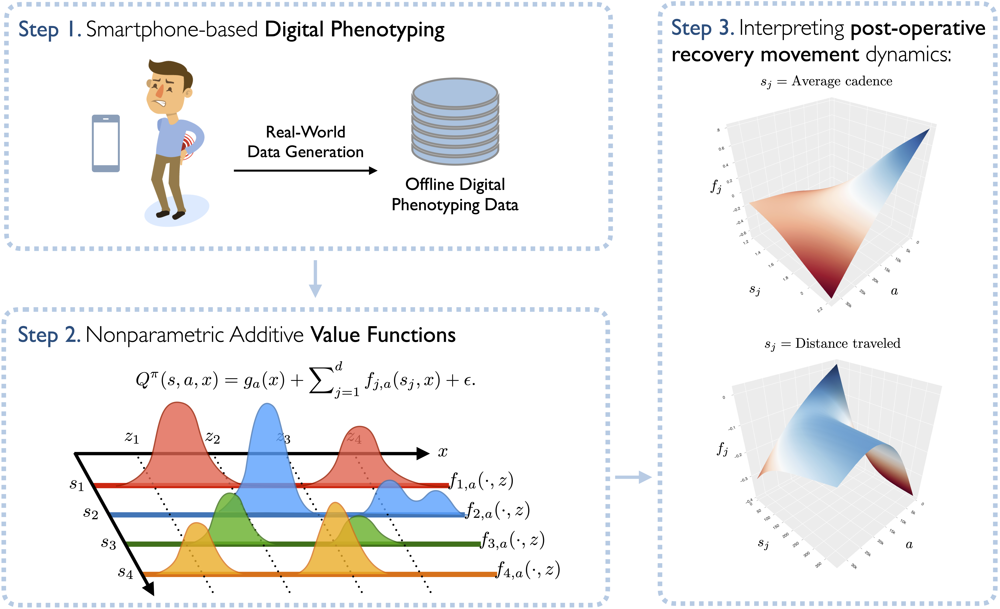
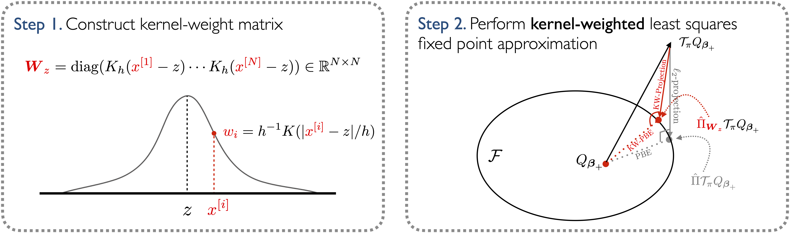

# KSH-LSPI: Kernel Sieve Hybrid Least-Squares Policy Iteration

This repository contains the implementation of Kernel Sieve Hybrid Least-Squares Policy Iteration (KSH-LSPI), a nonparametric reinforcement learning algorithm for learning interpretable value functions in continuous state spaces. This is the accompanying codebase for the paper "Nonparametric Additive Value Functions: Interpretable Reinforcement Learning with an Application to Surgical Recovery".

<p align="center">
  
  <br>
  <em>Figure 1: An overview of using nonparametric additive models for learning interpretable value functions.</em>
</p>

## Project Structure

```
.
├── simulation/            # Simulation experiments
│   ├── data/              # Simulation data generators
│   └── config.yaml        # Configuration parameters
├── models/                # Core algorithm implementations
│   └── ksh_lspi_algorithm.py  # Main KSH-LSPI implementation
└── application/          # Real-world applications
    ├── cluster_spine_continuous_action/  # Continuous action space implementation
    └── cluster_spine_discrete_action/    # Discrete action space implementation
```

## Installation

1. Create a conda environment:

```bash
conda create -n ksh_env python=3.10.9
conda activate ksh_env
```

2. Install required packages:

```bash
pip install numpy pandas torch patsy formulaic csaps matplotlib seaborn wandb d3rlpy
```

## Algorithm Overview

<p align="center">
  
  <br>
  <em>Figure 2: A step-by-step illustration of kernel-weighted least squares fixed point approximation.</em>
</p>

KSH-LSPI combines three key components:

* B-spline or trigonometric basis expansion for flexible function approximation
* Kernel-wighted least square fixed point approximation for local approximation
* Group LASSO regularization for component-wise feature selection using randomized coordinate descent

The algorithm learns interpretable, nonparametric value functions that decompose into additive components, making it possible to understand how individual continuous state features and their associated interactions contribute to the overall value estimate.

## Usage

### Simulation Experiments

To run simulation experiments:

```bash
cd simulation
python run_simulation.py config.yaml --nonlinear_states
```

Configuration parameters can be modified in `config.yaml`:

- MDP parameters (STATE_DIM, NUM_ACTIONS, etc.)
- KSH-LSPI parameters (DF, DEGREE, MU, etc.)
- Simulation parameters (NUM_EPISODES, MAX_STEPS, etc.)

Results can be tracked with wandb.

### Real-world Application

Data used for this paper is not publically available. Please reach out if you to `@patricknnamdi` if you are interested in receiving access.

For the surgical recovery application:

```bash
cd application/cluster_spine_discrete_action
python kshlspi_cluster_reg.py <state_idx> <df> <h> <degree> <mu> <lambda> <discount> <policy_iter>
```

## Key Files

- `models/ksh_lspi_algorithm.py`: Core implementation of KSH-LSPI (currently for continuous-action spaces)
- `simulation/simulated_mdp.py`: MDP environments for experiments
- `simulation/run_simulation.py`: Main simulation runner for generating samples.
- `application/cluster_spine_discrete_action/kshlspi_cluster_reg.py`: Real-world application implementation (under both continuous and discrete actions).

## Parameters

Key algorithm parameters:

- `df`: Degrees of freedom for basis functions
- `h`: Kernel bandwidth
- `mu`: Step size for coordinate descent
- `lambda_reg`: Regularization parameter
- `degree`: Polynomial degree for B-splines
- `discount`: Discount factor
- `max_policy_iter`: Maximum policy iterations

## Citation

If you use this code in your research, please cite:

```
[XYZ]
```
